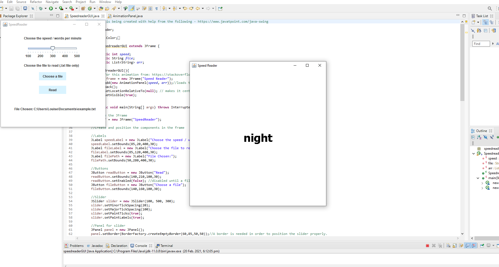

# SpeedReader
A Java Swing application for speed reading txt files

## Personal Project

### Purpose
I recently saw a video online that demonstrated the speeds at which it is possible to process text while reading.
It showed each word of a passage of text displayed one by one centered on a white background at a controlled speed.
Although impressed at the information the video was showing, I also thought that it would be useful to be able to read text in this way and
decided to attempt to recreate the animation with Java, with the aim to extend it into a flexible program that could control text speed.

I decided to use this project to learn Swing, and have created a basic GUI for the program and animation.

### Current state
This is an ongoing project that I am working on in my spare time, at the moment it can
- select a text file using a filechooser
- choose speed (words per minute) using a slider
- read in the text file
- display the file as an animation at the speed chosen
- pause and continue the animation

It is functional as is but is far from finished, I intend to extend it by:
- allowing font and color customisation
- adding: skip back, skip forward, repeat and other functionality to control the flow of text
- allow the speed to be changed while the file is being read
- allow opening the text in paragraph form at the place the text is paused
- allow the user to select a paragraph to continue from
- extend to read other file formats and not just .txt files.
- refine the GUI to make it more attractive
- add a title icon

### Currently working on
- styling
- adding functionality to skip backwards and forwards in the text.

#### Contents
- SpeedreaderGUI.java - creates a swing GUI for selecting speed and file to read and starting the animation
- TestPanel.java - a separate class for creating the animation
- example.txt - a text file containing 'Do not go gentle into that good night' by Dylan Thomas as an example text to read using the speedreader.

## Video Link - https://youtu.be/9ax15BtNaq8

